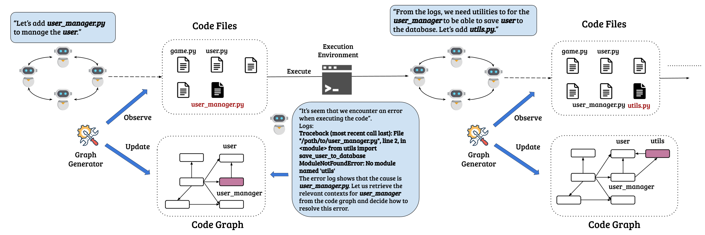
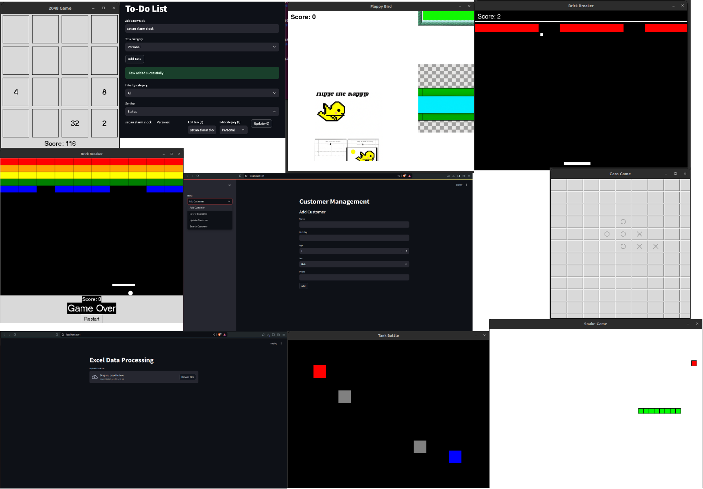

    
<p align="center">
    <br>
    
    <br>
<p>
<div align="center">
<!--   <a href="https://opensource.org/license/apache-2-0/">
  
  </a>
   <a href="https://www.python.org/downloads/release/python-380/">
  
  </a>  -->

[](https://opensource.org/licenses/MIT) [](https://www.python.org/downloads/release/python-380/) [](https://arxiv.org/abs/2406.11912)
    
# AgileCoder: Dynamic Collaborative Agents for Software Development based on Agile Methodology

<!-- 
[](https://github.com/bdqnghi/CodeTF_personal/blob/main/LICENSE)
[](https://www.python.org/downloads/release/python-390/)
[](https://github.com/psf/black) 
-->
 </div>   
    
## Table of Contents
  - [Overview](#overview)
  - [Quick Start](#quick-start)
  - [Dynamic Code Graph Generator](#dynamic-code-graph-generator)
  - [Demo](#demo)


## 📖 Overview
***AgileCoder*** integrates Agile Methodology into a multi-agent system framework, enabling a collaborative environment where software agents assume specific Agile roles such as Product Manager, Scrum Master, Developer, Senior Developer, and Tester. These agents work together to develop software efficiently and iteratively, simulating a dynamic and adaptive software development team.

In AgileCoder, each agent is not just a participant but a stakeholder in the software development process, engaging in sprints that mimic real-world Agile practices. This setup enhances the adaptability and effectiveness of development workflows, aligning closely with modern software engineering demands. The system is designed to handle the complexities of real-world software projects, supporting incremental development and continuous integration seamlessly.


Key Features of ***AgileCoder***:
- Dynamic Role Assignment: Agents dynamically assume roles based on the project needs and user inputs, ensuring flexibility and optimal resource utilization.
- Sprint-Based Development: The framework organizes development tasks into sprints, promoting rapid prototyping and frequent reassessment of project goals.
- Dynamic Code Graph Generator: This innovative module automatically generates and updates a dependency graph whenever the codebase changes, enhancing the agents’ understanding of the code structure and interdependencies. This feature is crucial for maintaining high accuracy in code generation and modifications.

<div align="center">
  
</div>

## 💻️ Quickstart
AgileCoder can be installed easily through pip:
``
pip install -e AgileCoder
``

### Configuration
AgileCoder currently supports the Azure OpenAI service. To configure the necessary environment variables, please set the following:

- **API_KEY**: Your Azure OpenAI API key.
- **RESOURCE_ENDPOINT**: The endpoint URL for your Azure OpenAI resource.
- **API_TYPE**: The type of Azure OpenAI API you are using (e.g., "azure").
- **API_VERSION**: The version of the Azure OpenAI API you are using (e.g., "2022-12-01").
- **API_ENGINE**: The name of the Azure OpenAI engine you want to use (e.g., "text-davinci-002").

You can set these environment variables either in your system settings or by creating a ``.env`` file in the project root directory with the following format:
```bash
API_KEY=your_api_key
RESOURCE_ENDPOINT=your_resource_endpoint
API_TYPE=azure
API_VERSION=2022-12-01
API_ENGINE=text-davinci-002
```
  
## Sample Command
To generate software using AgileCoder, use the following command:

``
agilecoder --task "<your software requirements>"
``

Replace ``<your software requirements>`` with a description of the software you want AgileCoder to create.

For example, to generate a Caro game in Python, run:

``
agilecoder --task "Create a Caro game in Python"
``

AgileCoder will process your requirements and generate the corresponding software based on the provided task description.
You can specify additional options and flags to customize the behavior of AgileCoder. For more information on the available options, run:
``
agilecoder --help
``

This will display the help message with a list of supported options and their descriptions.
Feel free to explore different software requirements and experiment with AgileCoder to generate various types of software projects tailored to your needs.
# Dynamic Code Graph Generator (DCGG)
<div align="center">
  
</div>
We propose Dynamic Code Graph Generator, a static-analysis based module that generates a Code Dependency Graph whenever agents make changes to the codebase. The Code Dependency Graph captures the relationships across files, serving as a reliable source for agents to retrieve the most relevant contexts for generating and modifying code accurately within the workflow.

**Key Benefits**:

- Real-time graph generation: The Dynamic Code Graph Generator will analyze the codebase and generate an updated Code Dependency Graph whenever changes are made by the agents.
- Dependency analysis: The module will identify and capture dependencies between files, functions, and modules within the codebase, providing a comprehensive overview of the relationships among various code components.
- Context retrieval: Agents will be able to query the Code Dependency Graph to retrieve the most relevant contexts (files, functions, or modules) related to the code being generated or edited. This will ensure that the agents have access to the necessary information to make accurate code modifications.
- Language-agnostic: The Dynamic Code Graph Generator will be designed to support multiple programming languages, making it adaptable to different codebases and development environments.
- Scalability: The module will be optimized to handle large codebases efficiently, ensuring that the graph generation process remains fast and responsive even as the codebase grows.

# Evaluation 
We will evaluate the performance of AgileCoder on two types of datasets to assess its effectiveness in generating code for different scenarios:
- Competitive Programming: HumanEval and MBPP
- Complex Software Requirements: We curate a new dataset called **ProjectDev**, which contains complex software requirements for generating complete software projects. This dataset will be designed to evaluate AgileCoder's ability to handle more intricate and real-world software development scenarios.

## Results
  
| Category             | Model                     | HumanEval | MBPP   |
|----------------------|---------------------------|-----------|--------|
| **LLMs (prompting)** |                           |           |        |
|                      | CodeGeeX-13B              | 18.9      | 26.9   |
|                      | PaLM Coder-540B           | 43.9      | 32.3   |
|                      | DeepSeeker-33B-Inst       | 79.3      | 70.0   |
|                      | GPT-3.5 Turbo             | 60.3      | 52.2   |
|                      | Claude 3 Haiku            | 75.9      | 80.4   |
|                      | GPT 4                     | 80.1      | 80.1   |
| **LLMs-based Agents**|                           |           |        |
| with GPT-3.5 Turbo   | ChatDev                   | 61.79     | 74.80  |
|                      | MetaGPT                   | 62.80     | 74.73  |
|                      | **AgileCoder**            | **70.53** | **80.92** |
| with Claude 3 Haiku  | ChatDev                   | 76.83     | 70.96  |
|                      | **AgileCoder**            | **79.27** | **84.31** |
| with GPT 4           | MetaGPT                   | 85.9      | 87.7   |
|                      | **AgileCoder**            | **90.85** | -      |


For **ProjectDev**, we evaluate the practical application of software projects generated by AgileCoder, ChatDev, and MetaGPT. The evaluation will involve human assessment to compare their performance with 3 criterias:
- Human evaluators will assess the executability of the generated software projects against the expected requirements specified in the ProjectDev dataset.
- For each generated software project, the evaluators will determine whether it is executable and meets the specified requirements.
- The success rate will be calculated as the percentage of requirements met by the executable software projects (e.g., if a generated program is executable and meets 4 out of 10 requirements, its executability rate is 40%).

| Metric                    | ChatDev | MetaGPT | AgileCoder |
|---------------------------|---------|---------|---------------|
| Executability             | 32.79   | 7.73    | **57.79**     |
| Entire Running Time (s)   | 120     | **48**  | 444           |
| Avg. Time/Sprint (s)      | -       | -       | 306           |
| #Sprints                  | -       | -       | 1.64          |
| Token Usage               | 7440    | **3029**| 36818         |
| Expenses (USD)            | 0.12    | **0.02**| 0.44          |
| #Errors                   | 6       | 32      | **0**         |


## ❓*What can AgileCoder do?*


<div align="center">
  
</div>

More details can be found in [screenshots](assets/screenshots/)


# Citing AgileCoder
More details can be found in our [paper](https://arxiv.org/abs/2406.11912). 

If you're using AgileCoder in your research or applications, please cite using this BibTeX:
```bibtex
@article{nguyen2024agilecoder,
  title={AgileCoder: Dynamic Collaborative Agents for Software Development based on Agile Methodology},
  author={Minh Huynh Nguyen and Thang Phan Chau and Phong X. Nguyen and Nghi D. Q. Bui},
  journal={arXiv preprint arXiv:2406.11912},
  year={2024}
}
```

# Contact us
If you have any questions, comments or suggestions, please do not hesitate to contact us.
- Website: [fpt-aicenter](https://www.fpt-aicenter.com/ai-residency/)
- Email: support.ailab@fpt.com

# License
[MIT License](LICENSE)
